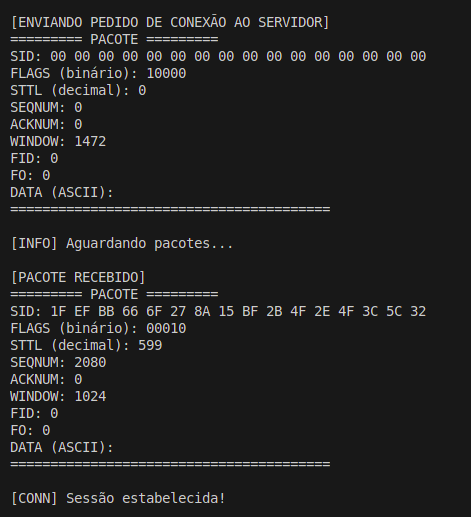
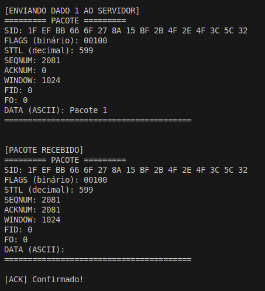
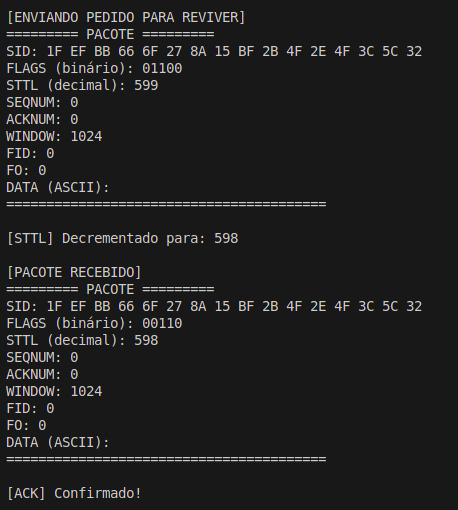

# Protocolo-Slow-Camada-de-Transporte

## Grupo:

- Arthur Trottmann Ramos - 14681052
- Karl Cruz Altenhofen - 14585976
- Maicon Chaves Marques - 14593530

Neste trabalho, ocorre a comunicação pelo protocolo SLOW (UDP) entre um peripheral e uma central, sendo essa localizada em slow.gmelodie.com:7033. Para tanto, foram implementadas funções referentes ao peripheral, como conexão e envio/recebimento de dados e formatação dos pacotes Slow e UUID.

## Rodando o Programa

### 1. Clone o Repositório

```
git clone https://github.com/ArthurTRamos/Protocolo-Slow-Camada-de-Transporte.git
```

### 2. Acesse a Pasta "src" do Diretório

```
cd src
```

### 3. Compile e Execute o Programa

```
make
make run
```

## Sobre o Código

O código está dividido em 4 módulos principais:

- ```main```: módulo principal, onde implementamos as threads de envio e recebimento de pacotes e as funções relacionadas a esses processos.

- ```ConnectCentral```: módulo voltado a conexão com a Central.

- ```UUIDPack```: módulo de implementação do subpacote UUID (criação, configuração de campos e recuperação).

- ```SlowPack```: módulo de implementação do pacote SLOW (criação, configuração dos campos e recuperação.

## Exemplos e Testes

Os testes foram feitos baseando-se nas seguintes formas de envio/recebimento de pacotes:

- Connect e setup: peripheral envia um pacote com a flag ```Connect = 1```, solicitando uma conexão. Em seguida, a central retorna um pacote com a flag ```Accept/Reject = 1``` e com os valores de ```sid``` e de ```sttl``` que deverão ser utilizados desse ponto em diante na comunicação.

<div align="center">
  
</div>

- Data e Ack: estabelecida a conexão, podemos enviar pacotes com dados e manipulando os valores dos campos ```Seqnum``` e ```Acknum```. Como retorno, a central retorna um pacote de confirmação com um novo ```Sttl```.

<div align="center">
  
</div>

- Revive e Ack: tenta reestabelecer uma conexão com o envio de um pacote semelhante ao de dados, mas com a flag ```Revive = 1```. Como retorno, a central pode aceitar o reestabelecimento da conexão (com um pacote de Ack) ou negá-lo.

<div align="center">
  
</div>

- Disconnect e Ack: finaliza uma conexão a partir do envio de um pacote com as flags ```Ack```, ```Connect``` e ```Revive``` ligadas. A central retorna um pacote de confirmação Ack.

<div align="center">
  
</div>
